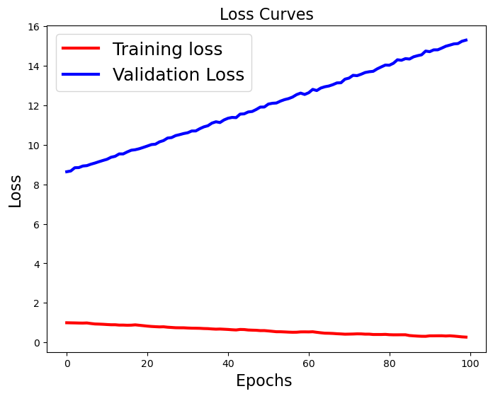
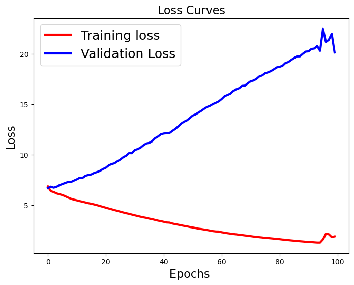
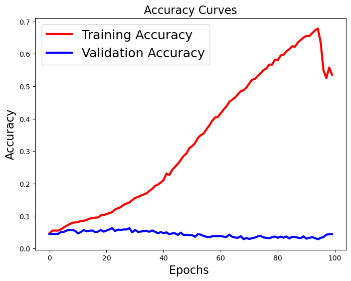
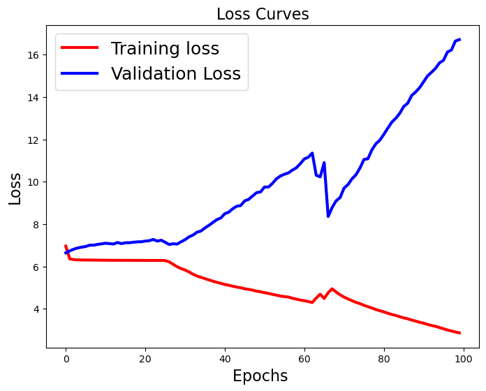
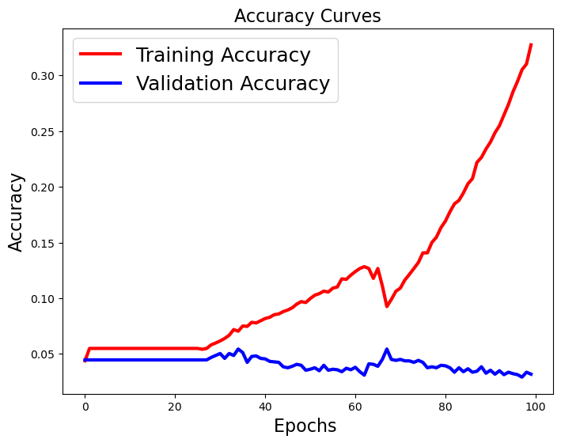

# PREDICT NEXT N NUMBER OF WORD OF A SENTENCE
This project usese text generation to predict the next word of a sentence. For determining the voabulary and the trainig set of the model I used the first 4 chapter of Moby Dick. 

### Preprocessing of the text
First I look at the average number of word that formed a sentence. Here it is 25, this will be the sequence lenght while creating the model. Then I tokenized the text and get rid of the unnecessary parts like punctuation. 

After cleaning the text I formed sentences with 26 words. The first 25 words of these are the features(X) and the 26th word is the label(y).
This is how the sequences look like:

_sentence[0]:_

_call me ishmael some years ago never mind how long precisely having little or no money in my purse and nothing particular to interest me on_

_senetnce[1]:_

_me ishmael some years ago never mind how long precisely having little or no money in my purse and nothing particular to interest me on shore_

### Model Creation
I defined the vocabulary using Tokenizer() from keras. Then converted the sentences into sequence using this tokenizer. 

Model1: batch_size=128, epochs=100

| Layer (type)            | Output Shape    | Param # |
|-------------------------|-----------------|---------|
| embedding_9 (Embedding) | (None, 25, 50)  | 135950  |
| lstm_18 (LSTM)          | (None, 25, 150) | 120600  |
| lstm_19 (LSTM)          | (None, 150)     | 180600  |
| dense_12 (Dense)        | (None, 150)     | 22650   |
| dense_13 (Dense)        | (None, 2719)    | 410569  |

Total params: 870369 (3.32 MB)

Trainable params: 870369 (3.32 MB)

Non-trainable params: 0 (0.00 Byte)

Learning Curves For Model1: Model is underfit

loss           |  accuracy
:-------------------------:|:-------------------------:
  |  

Model2: batch_size=128, epochs=100
| Layer (type)            | Output Shape    | Param # |
|-------------------------|-----------------|---------|
| embedding_9 (Embedding) | (None, 25, 50)  | 135950  |
| lstm_18 (LSTM)          | (None, 25, 250)  | 301000  |
| lstm_19 (LSTM)          | (None, 250)     | 501000  |
| dense_12 (Dense)        | (None, 250)     | 62750   |
| dense_13 (Dense)        | (None, 2719)    | 682469  |

Total params: 1683169 (6.42 MB)

Trainable params: 1683169 (6.42 MB)

Non-trainable params: 0 (0.00 Byte)

Learning Curves For Model2: Model is overfit 

loss           |  accuracy
:-------------------------:|:-------------------------:
  |  

Model3: batch_size=128, epochs=100

| Layer (type)            | Output Shape    | Param # |
|-------------------------|-----------------|---------|
| embedding_9 (Embedding) | (None, 25, 50)  | 135950  |
| lstm_18 (LSTM)          | (None, 25, 250)  | 301000  |
| lstm_19 (LSTM)          | (None, 150)     | 240600  |
| dense_12 (Dense)        | (None, 50)     | 7550   |
| dense_13 (Dense)        | (None, 2719)    | 138669  |

Total params: 823769 (3.14 MB)

Trainable params: 823769 (3.14 MB)

Non-trainable params: 0 (0.00 Byte)

Learning Curves For Model3:

loss           |  accuracy
:-------------------------:|:-------------------------:
  |  